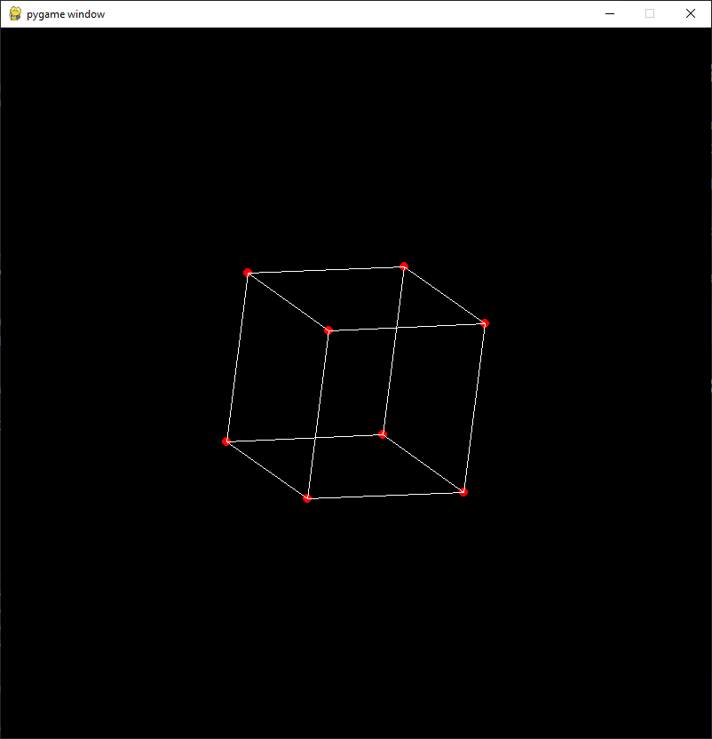

# Pygame cube visualization

This project consists of using projection and rotation matrix to display a Cube with pygame.
The project uses Numpy for handling matrices.

To install the dependencies:
```bash
pip install -r requirements.txt
```
and to execute
```bash
python3 main.py
```

## Demo



## Controls

ROTATE_SPEED by default is equal to 0.001
FOC_INC by default is equal to 0.1

|  Key | Command  |
|---|---|
| a |$ angle_y -=$ ROTATE_SPEED|
| d |$ angle_y +=$ ROTATE_SPEED|
| w |$ angle_z +=$ ROTATE_SPEED|
| s |$ angle_z -=$ ROTATE_SPEED|
| q |$ angle_x -=$ ROTATE_SPEED|
| e |$ angle_x +=$ ROTATE_SPEED|
| 1 |$ zoom +=$ FOC_INC|
| 2 |$ zoom -=$ FOC_INC|
| 3 |$ skew +=$ FOC_INC|
| 4 |$ skew -=$ FOC_INC|
| UP |$ z_{cam} -=$ SHIFT_INC|
| DOWN |$ z_{cam} +=$ SHIFT_INC|
| LEFT |$ x_{cam} +=$ SHIFT_INC|
| RIGHT |$ x_{cam} -=$ SHIFT_INC|
| SPACE |$ y_{cam} -=$ SHIFT_INC|
| L_SHIFT |$ y_{cam} +=$ SHIFT_INC|